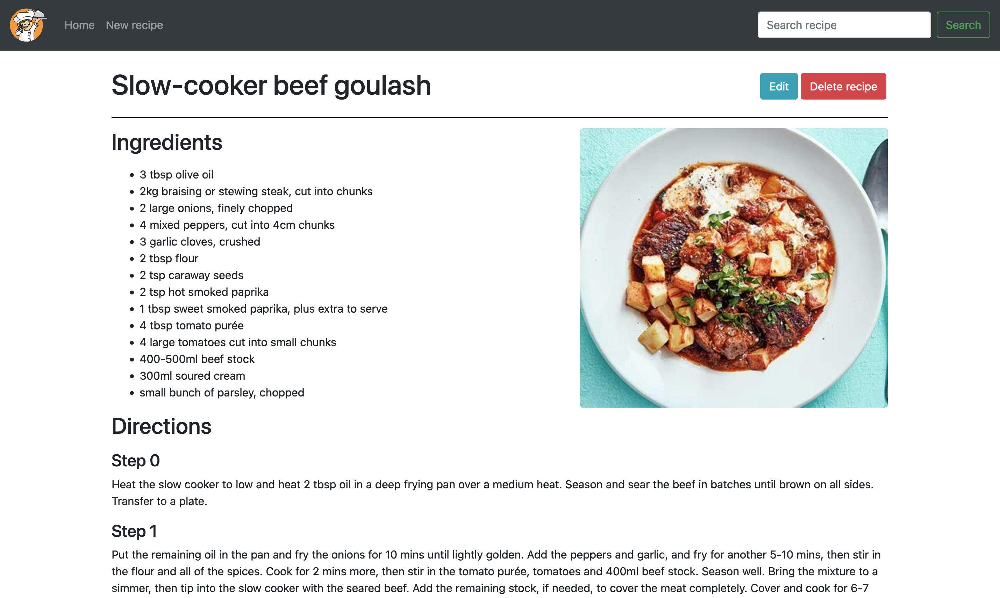
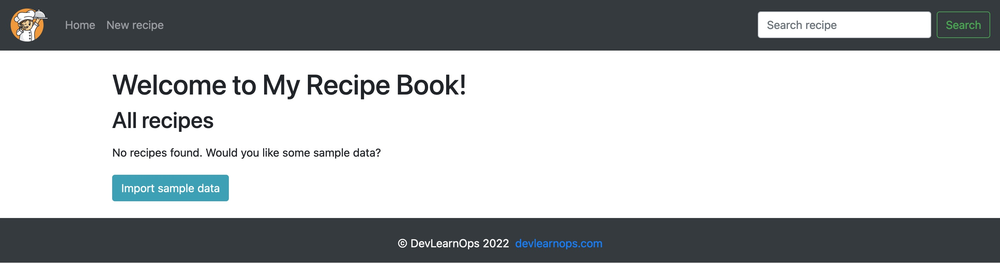

# Recipe Book

A simple web application that stores your favourite recipes. This demo application uses Python, Flask and MongoDB and can be used as a framework to study application development and automation!



## How to use this repository

This repository contains the **RecipeBook** application in the `app/` directory. To run this application you need the following requirements installed:

* Python3.9 or above
* [Pipenv](https://pypi.org/project/pipenv/) to install and manage python requirements
* [MongoDB](https://www.mongodb.com/) running in your system and listening on its default port `27017`

## Running the application

You can run the **RecipeBook** application with **GNU Make** or by manually running python commands.

### Running with make

If you already have **GNU Make** installed in your system, you can run the application by typing `make all` from the project's root.

```bash
cd recipebook/
make all
```

### Running with Python commands

This project uses [Pipenv](https://pypi.org/project/pipenv/) to install and manage python requirements. To run the application use pipenv to create a new Python virtual environment with `pipenv install`:

```bash
cd recipebook/
pipenv install
```

After Pipenv has finished installing requirements, run the Flask application in the new virtual environment with `pipenv run`:

```bash
cd recipebook/
pipenv run flask run
```

## Use RecipeBook app and import sample data

Once the application server is running, the application will available at port 5001. Open this URL in your browser: http://127.0.0.1:5001/index

If your Mongo database has not been initialised, the application will ask if you want to import some sample recipe data. Click the **Import sample data** button if you wish to populate the database with some demo recipes. If instead you want to create your own, click the **New Recipe** link in the navbar.


